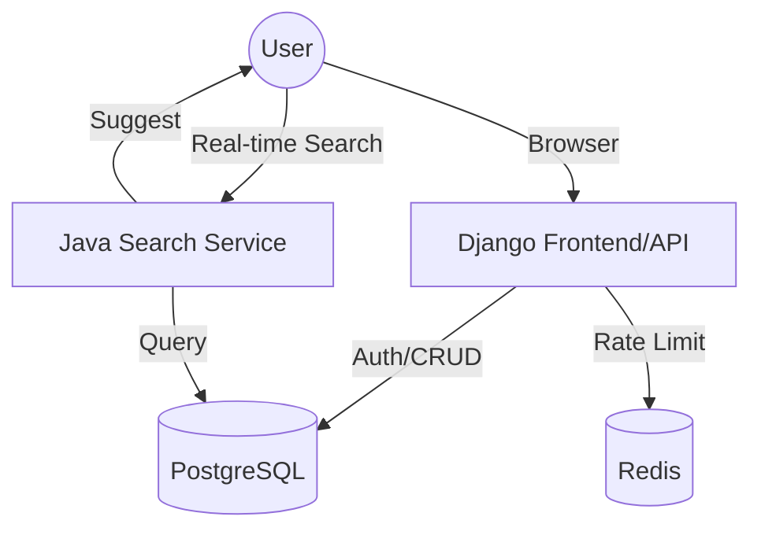

# 🔍 Lost & Found Portal

A premium, high-performance web platform designed for colleges and organizations to manage lost and found items efficiently. Built with a modern microservices-inspired architecture, featuring a **Django** frontend/core and a **Java Spring Boot** search service.


---

## 🚀 Features

- **💎 Premium UI**: Modern glassmorphism design with a dark-mode first aesthetic.
- **⚡ Hybrid Architecture**: Django handles user management, reporting, and item details, while a Java Spring Boot service provides ultra-fast search suggestions.
- **🔒 Hardened Security**:
    - Distributed Rate Limiting (Django Ratelimit).
    - Production-grade security headers (HSTS, CSRF, XSS Protection).
    - Environment-based configuration.
    - SQL Injection protection via safe ORM patterns.
- **🖼️ Media Handling**: Robust image upload and persistent serving for lost/found items.
- **📈 Scalability**: Powered by PostgreSQL and Redis for performance at scale.

---

## 🛠️ Tech Stack

- **Frontend**: Vanilla CSS (Custom Tokens), JavaScript, GSAP.
- **Django Core**: Python 3.11, Django 5.0, Django Rest Framework.
- **Search Engine**: Java 21, Spring Boot, Spring Data JPA.
- **Infrastructure**: Docker, Docker Compose, Gunicorn, WhiteNoise.
- **Services**:
    - **PostgreSQL**: Primary data storage.
    - **Redis**: Caching and Throttling backend.

---

## 🏗️ Architecture



---

## 📦 Getting Started

### Prerequisites

- [Docker](https://www.docker.com/products/docker-desktop/)
- [Docker Compose](https://docs.docker.com/compose/install/)

### Installation

1. **Clone the repository**:
   ```bash
   git clone https://github.com/yourusername/lost-found-portal.git
   cd lost-found-portal
   ```

2. **Setup Environment Variables**:
   Copy the example file and fill in your secrets:
   ```bash
   cp .env.example .env
   ```

3. **Spin up the Services**:
   ```bash
   docker-compose up -d --build
   ```

4. **Initialize the Database**:
   ```bash
   docker-compose exec django_app python manage.py migrate
   docker-compose exec django_app python manage.py collectstatic --no-input
   docker-compose exec django_app python populate_db.py
   ```

5. **Access the Portal**:
   - Web App: `http://localhost:8000`
   - Admin Panel: `http://localhost:8000/admin` (Create superuser via CLI if needed)

---

## 📈 Workflow

1. **Reporting**: Users log in and report lost or found items with descriptions, locations, and images.
2. **Browsing**: The global dashboard shows recent activity with high-visibility item cards.
3. **Searching**: As users type in the search bar, the **Java Search Service** fetches near-instant matches from the shared PostgreSQL database.
4. **Connecting**: Users view item details and contact the reporter to initiate recovery.

---

## 🛡️ Security Audit

This project has been hardened for production environments:
- **DDoS Protection**: API throttling configured to prevent spam.
- **Data Integrity**: Database-level indexing on high-traffic fields.
- **Session Security**: Secure login logic with immediate redirection and session feedback.

---

## 📄 License

This project is licensed under the MIT License - see the [LICENSE](LICENSE) file for details.
